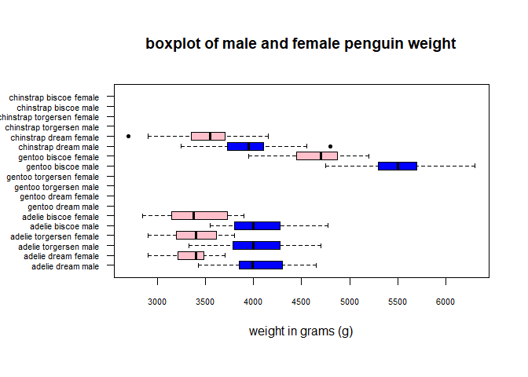

Penguin sex and weight in different penguin populations & species
(Palmer Archipelago - Anvers Island)
================
Bram Schouten
9/16/2020

# Header 1

## Header 2 Background information about the data </font>

The data, (reference: Gorman KB, Williams TD, Fraser WR (2014)
Ecological Sexual Dimorphism and Environmental Variability within a
Community of Antarctic Penguins (Genus Pygoscelis). PLoS ONE 9(3):
e90081. <doi:10.1371/journal.pone.0090081>), used was retrieved from:
<https://www.kaggle.com/parulpandey/palmer-archipelago-antarctica-penguin-data>
Which was made public under a CC-0 license.

<font size="12"> Aim of the analysis </font>

From this data the weight, sex, species and island where the penguin was
measured were interrogated and comparitively plotted in the form a a
boxplot.

1.The pengiun data (.CSV) is placed into a data.frame, named ‘alldata’

``` r
alldata = read.table("../data/penguins_lter.csv", header = TRUE, sep = ",")
```

2.Relevant columns, sex and weight are excised into a simpler data
frame, ‘selectdata’

``` r
selectdata = data.frame("sex" = alldata$Sex, "BodyMassGram" = alldata$Body.Mass..g.)
```

3.Used this data.frame and columns from ‘alldata’ to make lists of
booleans ’\*\_check’, important for filtering the weight column in
‘alldata’ later

``` r
male_check = selectdata$sex == 'MALE'

bisceo_check = alldata$Island == 'Biscoe'

torgersen_check = alldata$Island == 'Torgersen'

dream_check = alldata$Island == 'Dream'

female_check = selectdata$sex == 'FEMALE'

adelie_check = alldata$Species == 'Adelie Penguin (Pygoscelis adeliae)'

chinstrap_check = alldata$Species == 'Chinstrap penguin (Pygoscelis antarctica)'

gentoo_check = alldata$Species == 'Gentoo penguin (Pygoscelis papua)'
```

4.  the column in ‘alldata’ containing the weights (in grams) are placed
    into vectors according to the sex - island - species
    \[e.g. male\_check & dream\_check & adelie\_check\]

<!-- end list -->

``` r
adelie_dream_male_weight = selectdata$BodyMassGram[male_check & dream_check & adelie_check]
adelie_dream_female_weight = selectdata$BodyMassGram[female_check & dream_check & adelie_check]

adelie_biscoe_male_weight = selectdata$BodyMassGram[male_check & bisceo_check & adelie_check]
adelie_biscoe_female_weight = selectdata$BodyMassGram[female_check & bisceo_check & adelie_check]

adelie_torgersen_male_weight = selectdata$BodyMassGram[male_check & torgersen_check & adelie_check]
adelie_torgersen_female_weight = selectdata$BodyMassGram[female_check & torgersen_check & adelie_check]

chinstrap_dream_male_weight = selectdata$BodyMassGram[male_check & dream_check & chinstrap_check]
chinstrap_dream_female_weight = selectdata$BodyMassGram[female_check & dream_check & chinstrap_check]

chinstrap_biscoe_male_weight = selectdata$BodyMassGram[male_check & bisceo_check & chinstrap_check]
chinstrap_biscoe_female_weight = selectdata$BodyMassGram[female_check & bisceo_check & chinstrap_check]

chinstrap_torgersen_male_weight = selectdata$BodyMassGram[male_check & torgersen_check & chinstrap_check]
chinstrap_torgersen_female_weight = selectdata$BodyMassGram[female_check & torgersen_check & chinstrap_check]

gentoo_dream_male_weight = selectdata$BodyMassGram[male_check & dream_check & gentoo_check]
gentoo_dream_female_weight = selectdata$BodyMassGram[female_check & dream_check & gentoo_check]

gentoo_biscoe_male_weight = selectdata$BodyMassGram[male_check & bisceo_check & gentoo_check]
gentoo_biscoe_female_weight = selectdata$BodyMassGram[female_check & bisceo_check & gentoo_check]

gentoo_torgersen_male_weight = selectdata$BodyMassGram[male_check & torgersen_check & gentoo_check]
gentoo_torgersen_female_weight = selectdata$BodyMassGram[female_check & torgersen_check & gentoo_check]
```

<font size="12"> Plotting data in boxplot </font>

These vectors were plotted in a single boxplot, the boxes are coloured
inaccordance with the sex, more information was put on the Y-axis.
<!-- -->

<font size="12"> What does the boxplot show? </font>

Males tend to be larger than females across all species of penguin in
this sample of penguins. Only gentoo penguins measured were residing on
Biscoe island and female. Chinstrap penguins, males and females, were
only found on Dream island.
